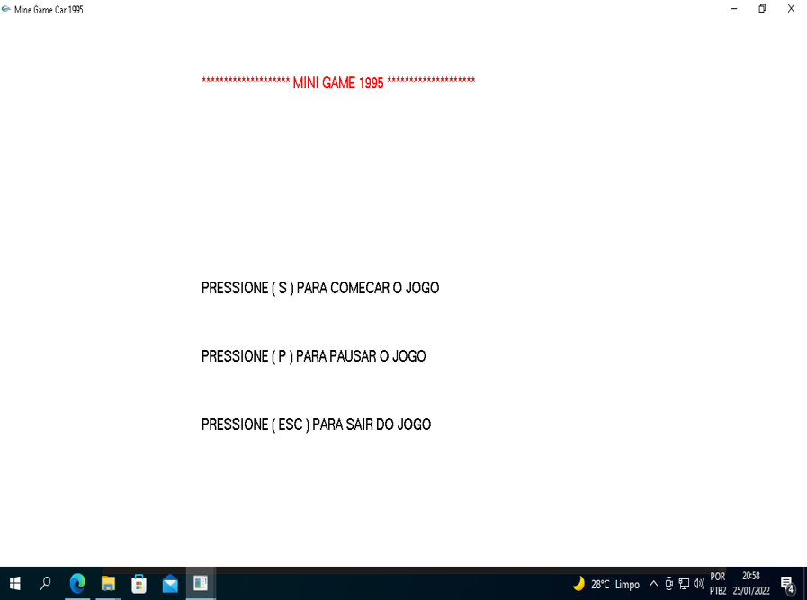
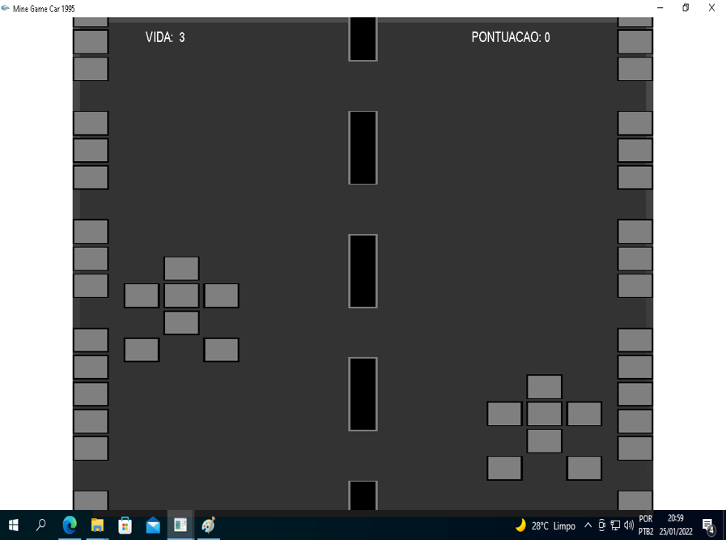
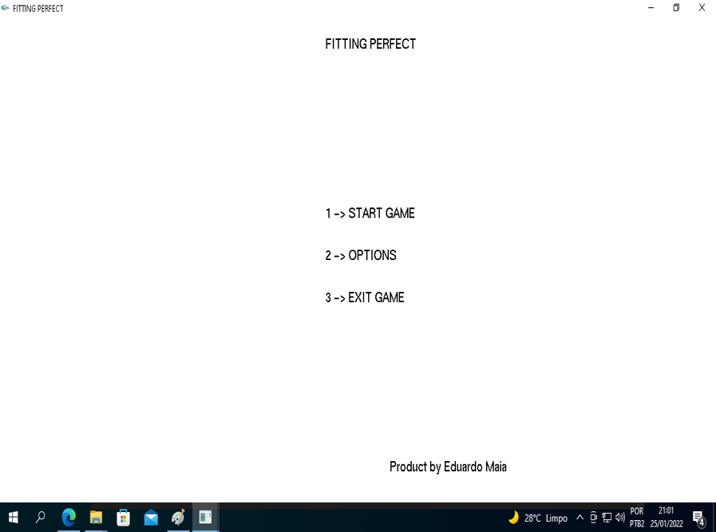
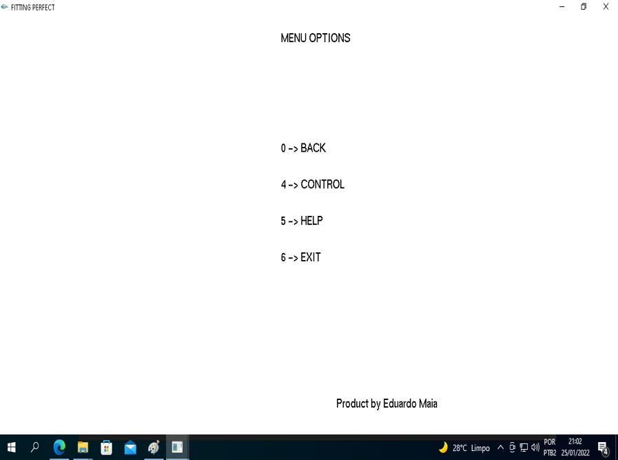
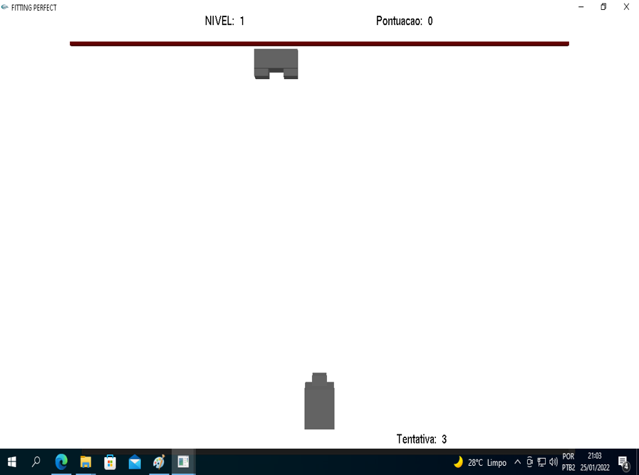
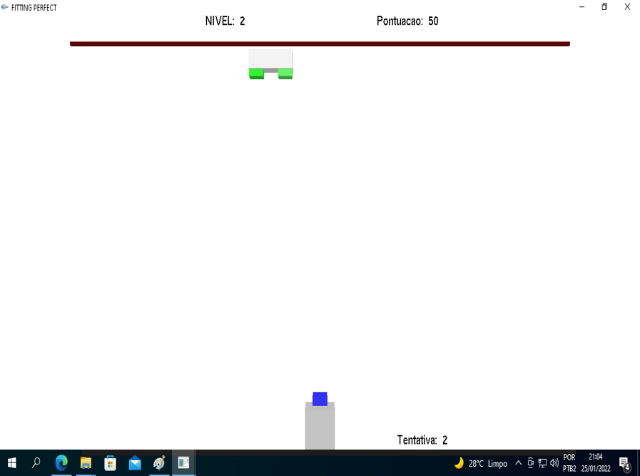

# Jogo-em-OpenGL
Jogos feito em OpenGL com uso da bilblioteca Glut32.

Como IDE utilizei o CodeBlocks.
 
## Versão de Windows:

  Para executar os jogos você deve instalar as DLLs de 32 e 64 bits em seu windows.

  A dll de 32 bits você colocará na pasta c:\Windows\SysWOW64 

  A dll de 64 bits você colocará na pasta c:\Windows\System32  
 
## Observação: 
  Existe uma pasta de Glut-Dev, dentro dela tem arquivos que incluem o OpenGL + Glut32
  para compor a ferramenta dentro da sua IDE CodeBlocks.
  
## 1-Jogo Mini Game 95 

  

## 2-Encaixe Perfeito

  
